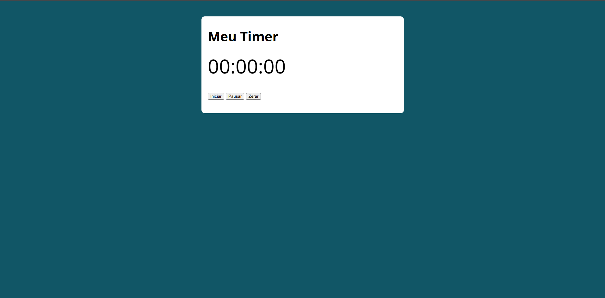

# Timer 
Aplicação de cronômetro desenvolvida com HTML, CSS e JavaScript, com foco na prática de manipulação do DOM e controle de tempo em aplicações web.

  
  <b>`プ ロ グ ラ マ`</b>
   
  <samp>
      Hi there! I'm <b>Valakzz</b> 👋
       
      Kotlin • Back-end • Dev in progress
  </samp>
  #

## Design do Projeto

 ## Sobre Projeto
 Aplicação de cronômetro desenvolvida com HTML, CSS e JavaScript, com foco na prática de manipulação do DOM e controle de tempo em aplicações web.

## ✅ Funcionalidades Implementadas

- [x] Iniciar o cronômetro
- [x] Pausar a contagem
- [x] Resetar o tempo
- [x] Atualização em tempo real

